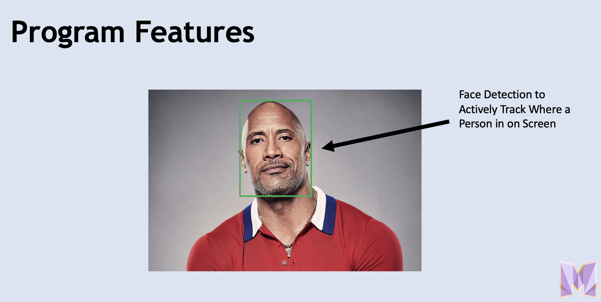
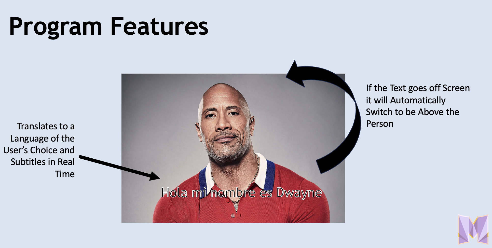

# Communicate.AI
## Using Computer Vision and AI to Overcome Language Barriers in real time

_By Arnav Deol, James Ashworth, Ankit Mudunuri, Joseph Khalaf_

###To install the project, download all files and run:
    - pip install -r requirements.txt

 

#### Modern translation services are powerful tools, but they're not effectively integrated into tomorrow's wearable tech.

This tool leverages google translate's API and google cloud integration to live translate spoken words in a wide variety of languages. The audio is read in with Google Cloud's speech to text AI API, and it can output the translated words in a live caption that uses OpenCV to follow the person speaking. While it completes the captions, it can also speak the translated text using a pre-selected voice model or a custom trained one by using Google Cloud's text to speech AI API.

Below is a short demonstration of the program's functionality

   

 
This project was our project for MHacks 16, check out our devpost submission!
